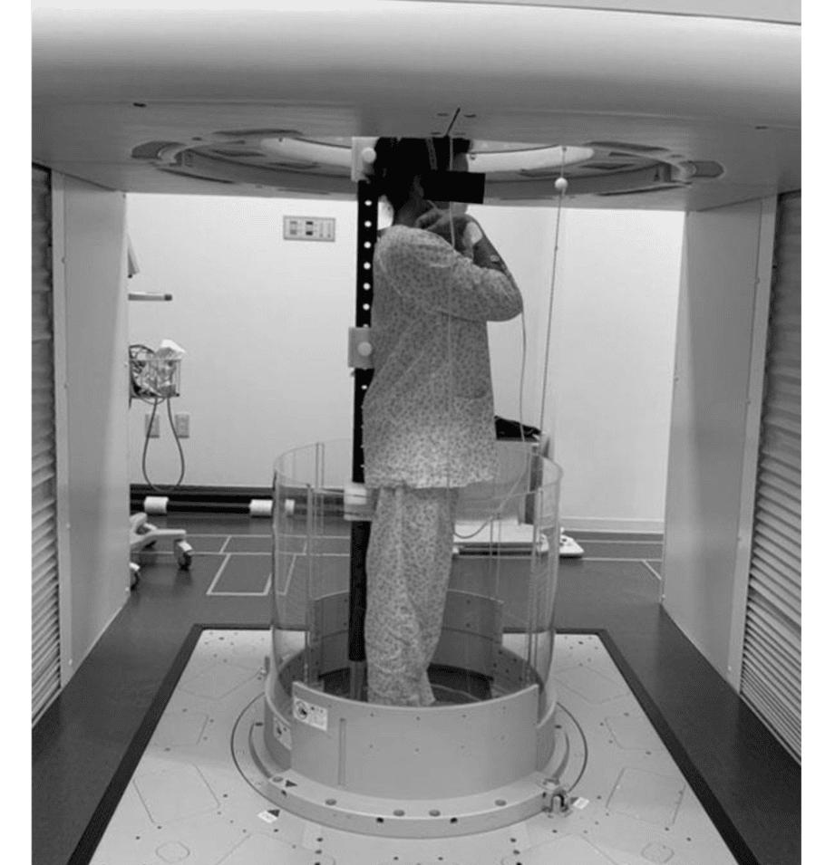
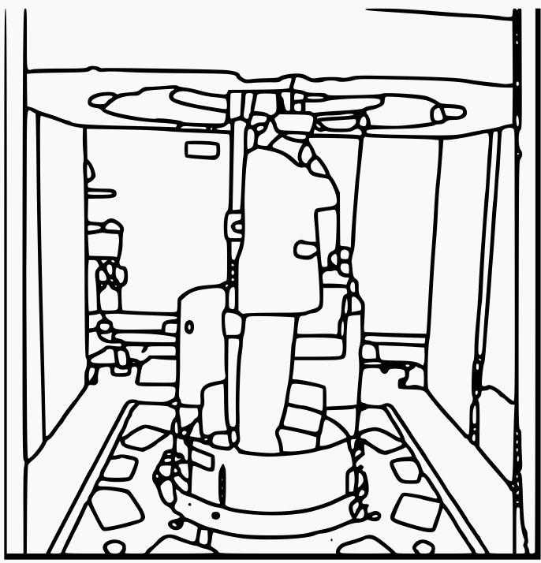

# 🖼️ Image to Sketch in Hard Way

## Overview

Welcome to the **Image to Sketch in Hard Way** application, a sophisticated tool for converting images into SVG sketches through advanced segmentation and processing techniques. This application harnesses the power of technologies like **Streamlit**, **PyTorch**, **OpenCV**, and the **Segment Anything Model (SAM)** to offer a robust and user-friendly experience for image processing tasks. Ideal for creating detailed vector graphics, this app provides the tools you need to transform your images into refined SVG sketches.


<p align="center">
  
  
</p>


## Features

- **Image Segmentation:** Utilizes the **Segment Anything Model (SAM)** to perform automatic mask generation on uploaded images.
- **Parameter Customization:** Offers adjustable parameters through a sidebar for precise control over the segmentation process, including points per side, IoU thresholds, and more.
- **Advanced Image Processing:** Applies Gaussian blur, contrast adjustment, and Zhang-Suen thinning for enhanced image quality and detail retention.
- **Vectorization and Conversion:** Converts processed images into SVG format for scalable and high-quality output using **Potrace**.
- **Cross-Platform Support:** Compatible with **Apple M-processors**, **CUDA**, and **CPU** environments.

## Requirements

- Python 3.9+
- Streamlit
- PyTorch
- OpenCV
- Pillow
- Supervision
- Segment Anything
- Scipy
- Skimage
- Potrace (for SVG conversion)

## Installation

Follow these steps to set up the Image to Sketch in Hard Way application on your local machine:

### 1. Create a Virtual Environment
```bash
python3.11 -m venv .venv
source .venv/bin/activate
```

### 2. Install Requirements
```bash
pip install -q -r requirements.txt
```

### 3. Download Model Weights
```bash
wget -q https://dl.fbaipublicfiles.com/segment_anything/sam_vit_h_4b8939.pth -P ./weights
```

## Running the Application

To launch the application, run the following command:
```bash
streamlit run app.py
```

## How It Works

### Image Upload and Processing

- **Upload an Image:** Start by uploading a JPEG or PNG image through the user interface.
- **Parameter Adjustment:** Use the sidebar to tweak various parameters such as:
  - **Points per Side:** Number of points used for mask generation.
  - **Prediction IoU Threshold:** Threshold for intersection over union during prediction.
  - **Stability Score Threshold:** Defines how stable a predicted mask should be.
  - **Box NMS Threshold:** Non-maximum suppression threshold for boxes.
  - **Crop Layers:** Determines the number of crop layers used in processing.
  - **Minimum Mask Region Area:** Filters out small mask regions.

### Segmentation and Annotation

- **Mask Generation:** The SAM model generates masks based on the adjusted parameters, highlighting regions of interest in the image.
- **Outline Drawing:** Segmentation outlines are drawn using OpenCV to visualize the mask contours, ensuring clarity and precision.
- **Line Thinning:** Zhang-Suen thinning is applied to reduce line thickness, making outlines crisp and clean.

### Image Enhancement and Conversion

- **Image Enhancements:** Gaussian blur and contrast adjustments are applied to enhance the image, providing a polished final result.
- **SVG Conversion:** The enhanced image is converted into SVG format using Potrace, allowing for scalable and high-quality vector graphics.

## Example Usage

Here's a quick example of how the image processing steps are applied:

- Upload your image.
- Adjust parameters as desired in the sidebar.
- View the segmented image with annotated outlines.
- See the enhanced image with improved contrast and detail.
- Save the output as an SVG file for further use.

## Error Handling

The application is designed to handle errors gracefully, providing informative messages for any issues that arise during processing, such as missing files or incompatible image formats.

## Contributing

We welcome contributions from the community! To contribute, follow these steps:

1. **Fork the repository.**
2. **Create a new branch:**
```bash
git checkout -b feature-branch
```

3. **Make your changes and commit them:**
```bash
git commit -m "Description of changes"
```

4. **Push your changes to GitHub:**
```bash
git push origin feature-branch
```

5. **Submit a pull request.**

## 📜 License

This project is licensed under the MIT License.

## 🍀 Licence

This project is licensed under the [GLWT (Good Luck With That)](./LICENCE) License.

## 🙌 Acknowledgments

- **Streamlit:** For the intuitive web app framework that speeds up development and deployment.
- **OpenAI and PyTorch:** For the powerful libraries enabling advanced machine learning and deep learning models.
- **OpenCV:** For providing the essential tools for image processing and computer vision tasks.
- **Segment Anything:** For the robust model used to achieve state-of-the-art segmentation results.
- **Potrace:** For the seamless conversion of raster images to SVG format.
